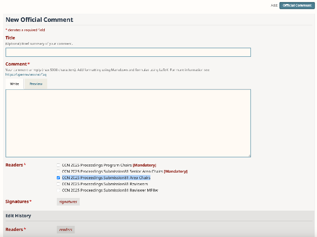

# Reviewer Guidelines

--8<-- "prior-version-warning.md"

--8<-- "2025-deadlines.md"

--8<-- "glossary-definitions.md"

Thank you once again for agreeing to review for CCN!

## Role

As a Reviewer, you carry the important responsibility of evaluating submissions, thereby
identifying work that should be highlighted at CCN as a Contributed Talk, as well as
giving the feedback to other's work that is vital to the scientific process.

Each submission to the CCN 2025 Extended Abstracts will receive at least 3 high-quality
reviews from Reviewers like yourself.
After the review period concludes, there will be no discussion period; instead, the
reviews will be forwarded to the CCN 2025 TPC to make talk selections.
Your communications with the Technical Programme Committee (TPC) will take place via
OpenReview.

## OpenReview Console

--8<-- "openreview/console.md"

### Setting comment visibility

--8<-- "openreview/comment-visibility.md"

## Timeline

| Period | Reviewer responsibilities | Dates |
| :--- | :--- | :--- |
| [Assignment](#assignment) | Reviewers matched. | [ea-review-period] |
| [Review Period](#reviews) | Submit reviews. | [ea-review-period] |
| Reviews Due |  | [ea-reviews-due], 11:59 PM (Anywhere on Earth; AoE) |

### Assignment

[ea-review-period]

--8<-- "reviewers/assignment-intro-ea.md"

--8<-- "openreview/email-profile-reminder.md"

#### Review deadline

**[ea-reviews-due], 11:59 PM Anywhere on Earth (AoE)**, is the reviewing deadline.
We are counting on you to submit your review(s) on or before this date so that we can
move onto the next step of the process.

#### Reciprocal reviewers

As stated in the [submission guidelines](Submission%20guidelines.md), if you are a
**Reciprocal Reviewer** (reviewing as part of an Extended Abstract submission) and do
not submit all assigned reviews by this date, the relevant submission(s) may not be
considered for a Contributed Talk.

### Reviews

[ea-review-period]

As a reviewer, you will evaluate submissions assigned to you and provide high-quality
feedback to help identify work that should be highlighted at CCN as a Contributed Talk.

--8<-- "reviewers/review-form.md"

#### Things to flag

If you note any of the following in your submissions, please flag them with the TPC.

--8<-- "reviewers/things-to-flag-ea.md"

## Policies

--8<-- "reviewers/common-policies-ea.md"

### Anonymization

--8<-- "policies/blinding.md"

Only the [TPC] knows your identity as a reviewer.

### Interdisciplinarity

--8<-- "policies/interdisciplinarity.md"

### Flexibility

--8<-- "policies/flexibility.md"

--8<-- "contact-info.md"
