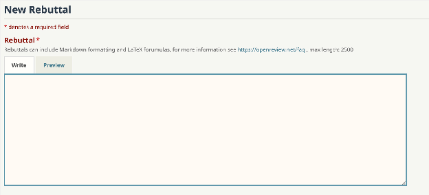
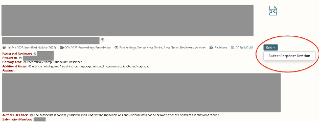

# Author Response Guidelines

--8<-- "prior-version-warning.md"

Thank you for submitting your work to the CCN Proceedings track.
In this document, we outline the Proceedings review and decision processes that are
relevant to authors of submissions.

## Timeline

Dates and deadlines specific to the CCN Proceedings track are:

**Reviews Released:** {{ config.extra.year2025_proceedings_reviews_released }}

**Author Responses Due:** [{{ config.extra.year2025_proceedings_author_response_due }},
11:59 PM Anywhere on
Earth](https://www.timeanddate.com/worldclock/converter.html?iso=20250415T115900&p1=tz_aoe)

**Author-Reviewer Discussion:** {{ config.extra.year2025_proceedings_discussion_period
}}

**Proceedings Decisions Released** (*)**:** {{
config.extra.year2025_proceedings_proceedings_decisions }}

(*) Proceedings decisions are related to but not exactly the same as presentation format
(poster) decisions at CCN 2025: **accepted** Proceedings papers **will** receive a
poster; Proceedings submissions that are not accepted will go through another decision
stage for the Extended Abstract track; all **accepted** Extended Abstracts **will**
receive a poster. For more details, see the
[CfP](https://2025.ccneuro.org/call-for-papers/).

### Release of reviews

Reviewers were instructed to submit reviews by {{
config.extra.year2025_proceedings_reviews_due }}, AoE. This was followed by a 2-day
period in which missing reviews were completed by emergency reviewers so that each
Proceedings submission received at least 3 quality reviews.
Reviews were released to authors on **{{
config.extra.year2025_proceedings_reviews_released }}**.

### Review content

Reviewers were asked to evaluate submissions according to their **interest**,
**soundness**, and **clarity**, and to provide comments on their evaluations.
The categorical evaluations had the following options:

**Interest**

*To what extent is this work relevant to CCN?*

**Broad** (interdisciplinary appeal across the communities at CCN)

**Disciplinary** (significant within AI, cognitive science, or neuroscience)

**Specialized** (primarily relevant to experts in a specific subfield)

**Soundness**

*Does the evidence support the claims?
Are the right methods used?*

**Strong** (exhaustive evidence to supports claims; convergent evidence from multiple
methodologies)

**Adequate** (appropriate methodology; evidence consistent with claims)

**Needs improvement** (lacks critical evidence; has methodological flaws that undermine
conclusions)

**Clarity**

*Are the evidence and contributions clearly communicated?
Are things detailed to facilitate reproducibility?*

**Exceptional** (understandable to a broad audience, reproducible, pedagogical)

**Adequate** (understandable to an expert audience)

**Needs improvement** (difficult to understand even for experts in the subfield)

### Author response to reviews

Once reviews are released, you are invited to write an author response (AKA a
“Rebuttal”) to **each individual review**. To do this, you can write a response under
each official review by clicking the button “**Rebuttal**” ([Figure
1](#figure-1.-add-rebuttal)) in the lower right corner of each review.
The deadline for submitting these author responses is **{{
config.extra.year2025_proceedings_author_response_due }}**. You must write an author
response before this date to participate in any follow-up discussion during the
author-reviewer discussion period that immediately follows.

Each of these text responses has a 2500 character limit.
Please ensure your responses are productive and respectful of the reviewer’s opinions
and time, and focus your response on critical concerns raised by the reviewers.
You are not required to respond to every point in a review, and should focus on those
that are critical for a reviewer’s evaluation (see “Review content” above).

All reviewers for each submission will be able to see these responses, so it is fine to
point a reviewer to a response written for a different review.
For example, if two reviewers ask the same question, you can answer it in the response
to one reviewer, and then ask the other reviewer to find the answer there.

### Author response revision of submission PDF

In addition to the response, authors are allowed, but not required, to submit a
**revised PDF** based on reviewer comments.
To do this, you can edit the submission PDF by clicking the button “**Edit**” then
selecting “**Author Response Revision**” ([Figure 2](#figure-2.-edit-submission)). Note,
however, that you should not add new results, unless directly requested by a reviewer
(e.g., minor additional statistical analyses).
Revisions can be uploaded as soon as reviews are released.
The deadline for revising the submission PDF is the same as the author responses, **{{
config.extra.year2025_proceedings_author_response_due }}**.

The 8-page limit still applies to the main text at this stage.
Significant violations (of more than a paragraph) of the 8-page main text limit in a
revised PDF after **[author-response-due]** will result in a desk rejection.
If a reviewer requested methodological details for reproducibility that are difficult to
fit into the main text, you may add these details to the supplement, and add a pointer
in the main text. It can be helpful for reviewers to understand your revisions if you
color added and/or revised text in blue or another non-black color (though you should
also make sure that reviewers know how to interpret this style by explaining this in
your text response).

### Author-reviewer discussion period

Reviewers are encouraged to respond to author responses immediately after {{
config.extra.year2025_proceedings_author_response_due }}, AoE to facilitate timely
interaction between authors and reviewers.
An additional week, starting {{ config.extra.year2025_proceedings_discussion_period }},
is exclusively reserved for author-reviewer discussion **based on the author response**.
In this period, authors can make one more concise response to reviewer comments, but no
longer update the paper PDF. The author-reviewer discussion closes on **{{
config.extra.year2025_proceedings_discussion_period }}**.

This post-review discussion period is meant as a wrap-up to any discussion between the
authors and the reviewers, and to give reviewers the option to update their reviews and
assessments based on author responses.
Authors and reviewers should abide by [CCN’s Code of
Conduct](https://2025.ccneuro.org/code-of-conduct/) while engaging in the discussion
process. Unprofessional or unethical behavior should be flagged to the AC via a private
comment.

### Meta-review and decision periods (internal)

Based on the reviews and the author rebuttals, ACs and SACs will write meta-reviews and
recommend Proceedings paper rejection or acceptance, which will receive final review
from the TPC and the PC. Decisions and meta-reviews will be released on **{{
config.extra.year2025_proceedings_proceedings_decisions }}**.

Furthermore, a small subset of accepted papers will be invited to present a Contributed
Talk, which will be announced in June.

Authors of Proceedings submissions that are not accepted will be invited to convert
their Proceedings submission to an Extended Abstract submission.
Instructions for this will be provided at a later stage.
There is no need to submit a Extended Abstract version of your Proceedings submission to
the Extended Abstracts track.

Anonymized reviews and discussion will be made public on OpenReview for accepted papers
only.

### Presenter policy

CCN 2025 maintains the historical policy that a given “Presenter” (the presenting author
as identified on OpenReview) can **present only a single contribution** at CCN. Since
CCN 2025 has two tracks with separate timelines, we allow Presenters to submit a
contribution to each track.
If both contributions are accepted for presentation at CCN 2025 (*), the Presenter will
be asked to select one of their contributions for presentation and withdraw the other.
This selection must be made between {{
config.extra.year2025_proceedings_presenter_selection_period }}, after decisions are
announced for all tracks.

(*) This can occur if a Presenter has both a Proceedings paper and an Extended Abstract
accepted, or a Presenter’s Proceedings paper is invited to the Extended Abstract track
after they have submitted a contribution directly to the Extended Abstracts track.
However, we do not allow multiple submissions from a single Presenter to the Extended
Abstracts track.

### Figure 1. Add Rebuttal

To start writing a text response to a review, use the “**Rebuttal**” button in the lower
right corner of the corresponding review.
When you click this, a box similar to the one above will appear, in which you will be
able to provide your author response text.

### Figure 2. Edit Submission

To revise the submission PDF during the author response period, use the “**Edit**”
button at the top of the OpenReview forum page.
The option “**Author Response Revision**” should be available via this list.

--8<-- "contact-info.md"
