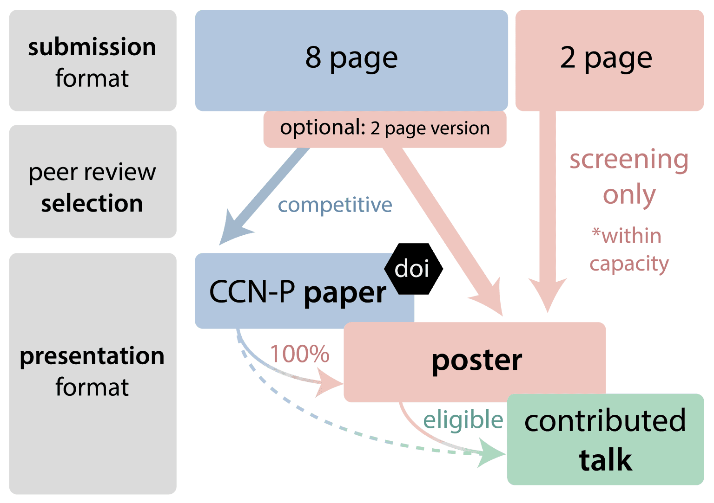

# Submission guidelines



## Submission process

Submissions to the Proceedings track consist of an 8-page PDF plus associated metadata
submitted via the OpenReview platform.

Each submission requires at least one author to register as a Reciprocal Reviewer.
You are an eligible Reciprocal Reviewer if you have received a PhD. The manuscript will
not be considered for a Contributed Talk if the Reciprocal Reviewer fails to fulfill
their reviewing responsibilities with due diligence, and the CCN-P paper is desk
rejected. Reviewers will be asked during review how certain they are of their judgment,
and their level of expertise in the particular subfield of this paper.

Papers undergo rigorous peer review and will have a rebuttal period during which authors
and reviewers discuss, overseen by area chairs and senior area chairs.
Acceptance rate targets approximately 25%, informed by reviewer ratings.

Accepted Proceedings papers receive a publication in CCN Proceedings (CCN-P) with DOI
assignment, are presented as posters, may be selected for a Contributed Talk, and have
reviews that will be made public on OpenReview.
Rejected Proceedings papers will be converted to a regular poster, if within scope and
if the authors submit a 2-page abstract.
These papers may also be selected for Contributed Talks, for which the reviews of the
Proceedings process will be used.
For rejected Proceedings papers, the original Proceedings submission and the reviews
will not be made publicly visible.

### Formatting requirements

The text, tables and figures of a CCN proceedings submission can be no longer than 8
pages, excluding references.

#### Abstract



#### Templates



Your initial submission must use the anonymized variant of your chosen template.





### Double-blind review





### Reciprocal reviewer policy



Authors in this category who fail to finish reviews by the author response stage may
have their paper submissions desk-rejected and may not be considered for Contributed
Talk when converted to the Extended Abstracts track.


### Use of large language models



### Presenter policy



### Dual submission policy



## Frequently Asked Questions





















### There seem to be two deadlines, which one…

**tl;dr:** On {{ proceedings_abstract_deadline_2026 }} we need your title, author list, and abstract (paper
summary), but you have until {{ proceedings_submission_deadline_2026 }} to upload the PDF. If you are unsure,
we advise you to keep {{ proceedings_abstract_deadline_2026 }} as an internal deadline.

Everything in the OpenReview submission form is due by the "**abstract registration
deadline"** {{ proceedings_abstract_deadline_2026 }}, anywhere on earth, except for the PDF. The PDF is due
by the "**full submission deadline"** on {{ proceedings_submission_deadline_2026 }}, anywhere on earth.
It will not be possible to edit the author list, the presenter, or the reciprocal
reviewer of a submission after {{ proceedings_abstract_deadline_2026 }}. It will be possible to make edits to
other submission metadata (including the title and the \~300-word abstract) from
{{ proceedings_abstract_deadline_plus_one_2026 }} to {{ proceedings_submission_deadline_2026 }}, but any major edits (that
substantially change the evidence or contributions of the paper) will result in a desk
rejection.

### Why are there two deadlines?

The two deadlines exist for us to have time to recruit and onboard reviewers signing up
as part of a submission, while keeping the final (PDF) deadline as late as our timeline
allows. We suggest thinking about the overall deadline as {{ proceedings_abstract_deadline_2026 }} so you
don't miss the abstract registration deadline.

### Can I include supplementary material?

Yes, you can include these in the PDF that you submit for review; by appending it after
the References. However, reviewers are not obliged to take this material into account.
Make sure any linked material is anonymized.
The supplementary material does not need to adhere to the 2-column format of the main
text (*i.e.*, it can be single-column).

### Do references count towards the 8-page limit?

No.

### Can I submit my manuscript to another venue or submit a previously published manuscript?

The Proceedings track does not allow the submission of manuscripts that have been
published or are under review elsewhere ("concurrent" or "dual" submissions).
However, after we have made a decision on your submission ({{ proceedings_decisions_2026 }}), you
may decide to submit the manuscript to another venue which may have its own policy on
prior publication. Accepted CCN Proceedings papers will have an assigned DOI, which may
affect this decision.


